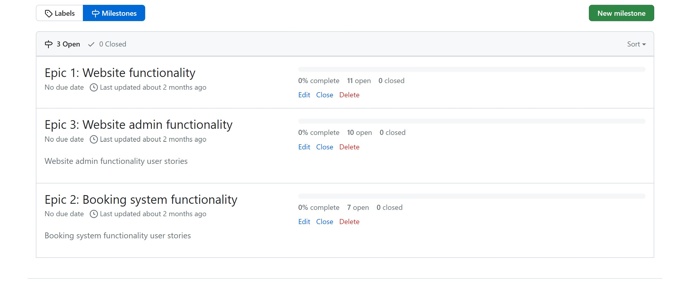
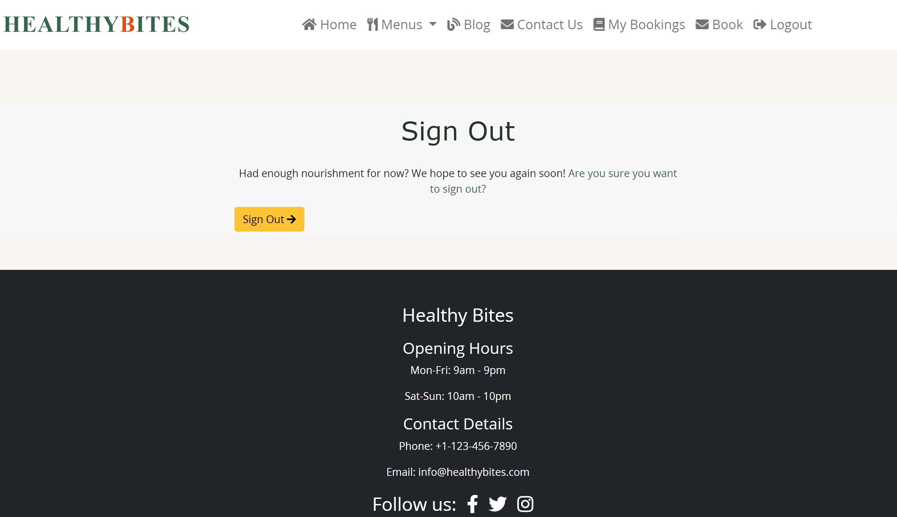

# Healthy Bites

**Mohamed Abdillahi**

 [Visit live website](#)  

## Table of Contents
  - [About](#about)
  - [User Goals](#user-goals)
  - [Site Owner Goals](#site-owner-goals)
  - [User Experience](#user-experience)
  - [User Stories](#user-stories)
  - [Design](#design)
    - [Colours](#colours)
    - [Fonts](#fonts)
    - [Structure](#structure)
      - [Website pages](#website-pages)
      - [Database](#database)
    - [Wireframes](#wireframes)
  - [Technologies Used](#technologies-used)
  - [Features](#features)
  - [Validation](#validation)
  - [Testing](#testing)
    - [Manual testing](#manual-testing)
    - [Automated testing](#automated-testing)
    - [Tests on various devices](#tests-on-various-devices)
    - [Browser compatibility](#browser-compatibility)
  - [Bugs](#bugs)
  - [Heroku Deployment](#heroku-deployment)
  - [Credits](#credits)
  - [Acknowledgements](#acknowledgements)

  ### About

Healthy Bites is a unique dining experience offering nourishing food options for the health-conscious individual. Users can create an account, book a table to enjoy our nutritious meals, explore our diverse food, smoothies and milkshake menus, and stay updated with health tips and updates on our blog.

### User Goals

 - To make a reservation for a health-focused dining experience.
 - To view, edit, and cancel reservations as needed.
 - To explore nutritious food, smoothies and milkshake menus, read health-related blogs, and access contact information.

### Site Owner Goals

 - To offer an online solution that lets users seamlessly book their meals.
 - To attract a larger health-conscious clientele with a refined website.
 - To present a modern application featuring intuitive navigation.
 - To ensure the platform is fully responsive and accessible to all users.

## User Experience

### Target Audience
 - Individuals aiming to book a table for a nutritious meal alone, with family, or with friends.
 - Returning patrons and newcomers to Healthy Bites.
 - Tourists visiting the area in search of a wholesome meal or drink.
 - Event-goers in the vicinity for a sports event, music concert, or other activities.
 - Local professionals seeking a healthy meal or refreshment post-work.

### User Requirements and Expectations

 - A site that is completely responsive across devices.
 - Accessible to everyone, including those with disabilities.
 - A refreshing and welcoming design reflecting the health-focused brand.
 - Integration with social media for updates and engagement.
 - Easily accessible contact details and information.
 - Compliant with web accessibility standards.

 ##### Back to [top](#table-of-contents)

## User Stories

### Users

1. As a User, I can effortlessly navigate through the site to easily access every feature (Must have).
2. As a User, I can utilize a navbar, footer, and social icons, facilitating site navigation, accessing health-focused menus, and connecting with Healthy Bites on social platforms (Must have).
3. As a Site Owner, I can provide a "Contact Us" page ensuring customers can reach out with inquiries or feedback (Must have).
4. As a User, I can view opening hours and contact details, helping me understand the operational hours and multiple ways to communicate – email, phone, or socials (Must have).
5. As a User, I can create a reservation by selecting a suitable date and time, ensuring a table for my health-focused dining experience (Must have).
6. As a User, I can modify my reservation, enabling me to opt for an alternative available slot (Must have).
7. As a User, I can cancel my reservation, offering flexibility if my plans change (Must have).
8. As a User, I can review my reservation details, reaffirming the time and date I've chosen (Must have).
9. As a User, I receive notifications after actions like creating, editing, or deleting a reservation, giving me assurance about the success of my actions (Must have).
10. As a User, I'm prompted to register, allowing me to proceed with a reservation (Must have).
11. As a User, I can sign up, ensuring my details are saved for more streamlined reservations in the future (Must have).
12. As a User, I can log in, granting me access to book a table (Must have).
13. As a User, I can view my login status, providing clarity on my session's state (Must have).
14. As an Admin/Authorized User, I can switch booking confirmations between auto and manual modes, ensuring efficient management during peak periods and preventing overbookings (Must have).
15. As a User, I can explore the site's blog, enriching my knowledge on healthy living and the latest updates from Healthy Bites (Should have).
16. As a User, I can peruse the food, smoothies and milkshake menus, aiding my decision on whether to dine at Healthy Bites (Must have).
17. As a User, I'm restricted from reserving past dates, ensuring all bookings are valid (Must have).
18. As a User, I can browse blog content page by page, offering a user-friendly experience without overwhelming information (Should have).
19. As a User, I'm prevented from double booking a table, maintaining the integrity and accuracy of reservations (Must have).

### Admin / Authorised User
21. As an Admin/Authorised User, I need secure access to the backend, allowing me to oversee and modify health-centric content and reservations. (Must have)
22. As an Admin/Authorised User, I can manually input table bookings, adapting to those customers who prefer phone or email reservations for their health-driven dining experiences. (Should have)
23. As an Admin/Authorised User, I have the flexibility to approve or decline table reservations, which ensures seamless operations and averts overlapping bookings. (Must have)
24. As an Admin, I can modify our healthy food and beverage offerings, enabling us to stay updated with dietary trends and patron preferences. (Must have)
25. As an Admin, I have a full suite of tools for menu management, allowing me to oversee, adjust, or renew our nutritious offerings with efficiency. (Must have)
26. As an Admin/Authorised User, I can sift through bookings and health-conscious menu items, ensuring swift access to vital data. (Should have)
27. As an Admin/Authorised User, I possess tools to categorize reservations by specific dates, enhancing the clarity and ease of daily operational assessments. (Should have)

### Site Owner  
28. As a Site Owner, my goal is to offer a platform that adjusts seamlessly across devices, ensuring a top-tier experience for our health-focused patrons. (Must have)
29. As a Site Owner, I stress the importance of accurate data entry, implementing checks and safeguards to uphold data quality and reduce inaccuracies. (Must have)

### Kanban, Epics & User Stories
 - The Healthy Bites team utilized GitHub Kanban to keep a clear overview of ongoing user stories.
 - Key features were outlined as Epics with the help of the milestones functionality.
 - The board was structured with the statuses "To Do", "Doing", and "Done" to ensure a smooth flow of tasks and assignments.

Epics

User Stories

Kanban

##### Back to [top](#table-of-contents)

## Design

### Colours

For Healthy Bites, I opted for a light color palette that embodies the joy and vitality associated with wholesome eating. The intention was to craft a visual environment that exudes both happiness and health. In particular, the green text was chosen to symbolize organic, farm-fresh produce, echoing the shades of verdant leaves and the essence of nature.

This color scheme perfectly resonates with the core values of Healthy Bites, emphasizing the importance of natural, nutritious choices.

Colour pallet

### Fonts

 For Healthy Bites, I chose the 'Open Sans' font due to its clean and modern aesthetics, aligning perfectly with our fresh and health-conscious brand image. For branding elements, we utilized the 'Zilla Slab' font, offering a distinct contrast. As a fallback, the sans-serif and serif fonts ensure consistent readability across different platforms

### Structure

#### Website pages

Aiming for an intuitive and user-friendly experience, Healthy Bites' website layout is designed with familiarity in mind. This includes a navigation bar situated at the top of all pages, ensuring easy access to all features. Furthermore, for optimal mobile viewing, a hamburger menu icon is incorporated for smaller screens, promoting seamless navigation regardless of device size.

The footer is designed to bridge the online gap between Healthy Bites and our patrons. It showcases relevant social media icons, inviting users to connect with our brand on various platforms. By doing so, we aim to foster a sense of community, boost our digital presence, and share the joys of healthy living with a broader audience.

Website Breakdown:

 - Homepage: A welcoming space featuring curated cards, enabling users to instantly book a table or browse our nutritious food and drink menus.

 - Food Menu: An appetizing display of our diverse culinary options, all fetched from our database and neatly categorized into starters, mains, and desserts.

 - Smoothies and milkshakes menu: Quench your thirst by exploring our assortment of beverages, all listed according to their type.

 - Blog Section: Dive into a collection of health-centric articles, with content curated by our team and displayed in sets of four per page for easy browsing.

 - Detailed Blog View: Engage deeper with a chosen blog article. Registered members can also share their insights through comments, awaiting moderation for quality assurance.

 - Reservation Desk: Registered patrons can seamlessly book their dining experience by specifying the table location, date, time, and guest count.

 - My Reservations: Users can revisit their booking history, with past reservations automatically archived for clarity.

 - Modify Reservation: Flexibility is key, and users can easily amend details like date, time, table position, and number of guests.

 - Terminate Reservation: In case plans change, users can effortlessly cancel their bookings, with data being promptly removed from our database.

 - Reach Out: Got queries or feedback? Our "Contact Us" page offers registered members the convenience of direct messaging. Alternatively, visitors can get in touch via provided email, phone, or even drop by our physical address.

 - Authentication Desk: A portal for users to either log in for personalized services or log out post their session.

 - Join Us: A streamlined registration process invites users to become part of the Healthy Bites community and make the most of our booking features.

 - Oops! 404: An aesthetically designed error page ensures users are informed and guided aptly when they stumble upon non-existent content.

#### Database

- Built with Python and the Django framework with a database of a Postgres for the deployed Heroku version(production)

##### Database scheme Model

  _______________________________________________________________________________________________

  
The Blog Model contains the following:

 - post_id 
 - title 
 - slug 
 - author_id 
 - created_date 
 - updated_date 
 - content 
 - featured_image 
 - excerpt 
 - status 
 - likes 

 The Comment Model contains the following:

 - id 
 - post_id 
 - name 
 - email 
 - body 
 - created_date 
 - approved 

 

Blog and Comment Model

  _______________________________________________________________________________________________

  
  The MealOption Model contains the following:

 - meal_id 
 - meal_name 
 - description 
 - price 
 - meal_category 
 - available 

   
   The Beverage Model contains the following:

 - beverage_id 
 - beverage_name 
 - description 
 - price 
 - beverage_category 
 - available 

 

MealOption and Beverage Model

  _______________________________________________________________________________________________

  
   The Table Model contains the following:

  - id 
  - name 
  - max_seats 

     The Booking Model contains the following:

 - id 
 - created_date 
 - requested_date 
 - requested_time 
 - table_id 
 - user_id 
 - name 
 - email 
 - phone 
 - status 
 - guest_count 

 

Table and Booking Model

  _______________________________________________________________________________________________

  

    The MyContact Model contains the following:

 - message_id 
 - created_date 
 - user_id 
 - name 
 - email 
 - phone 
 - message 

MyContact Model

### Wireframes
The wireframes were created using Balsamiq

## Technologies Used

### Languages & Frameworks

 - HTML: The backbone of web pages, used for structuring content.
 - CSS: Applied for styling and visually enhancing the website's design.
 - JavaScript: Used for adding interactive features and functionality.
 - Python: Utilized for server-side scripting and logic.
 - Django: A powerful Python web framework for building web applications efficiently.

### Libraries & Tools

 - Am I Responsive: Ensured responsiveness and compatibility on various devices.
 - Balsamiq: Employed for creating wireframes and mockups.
 - Bootstrap v5.2: A popular CSS framework for responsive and visually appealing design.
 - Cloudinary: Used for media management and optimization.
 - Favicon.io: Generated custom favicons for the website.
 - Chrome DevTools: Assisted in debugging and optimizing web pages.
 - Font Awesome: Provided a wide range of icons for enhancing user interface.
 - Git: Version control system for tracking changes in code.
 - GitHub: Platform for hosting and collaborating on code repositories.
 - Google Fonts: Offered a diverse collection of web fonts for improved typography.
 - Heroku Platform: Deployed the application on the Heroku cloud platform.
 - Postgres: Chosen as the database management system for the production version.
 - Summernote: Integrated a rich text editor for enhanced content creation.

Validation Tools:

 - WC3 Validator: Ensured compliance with HTML and XHTML standards.
 - Jigsaw W3 Validator: Checked CSS files for validity.
 - JShint: Helped detect and fix errors in JavaScript code.
 - Pycodestyle (PEP8): Enforced Python code style standards.
 - Lighthouse: Analyzed and improved web page performance.
 - Wave Validator: Ensured accessibility compliance.

##### Back to [top](#table-of-contents)

## Features

### Home page
- The home page is a blend of modern design elements that highlight the essence of health and nutrition.
 - It includes a navigation bar, main content area showcasing the best of Healthy Bites, and a footer for essential links and information.

See feature images

### Logo & Navigation
 - A bespoke logo represents Healthy Bites, encapsulating its core values.
 - The design is fully responsive, catering to various screen sizes.
 - On smaller screens, it gracefully transitions to a hamburger menu.
 - Clear indicators show whether a user is logged in or out.
 - The navigation bar is consistently present across all pages for easy access.

See feature images

### Footer
 - The footer houses links to Healthy Bites' active social media profiles.
 - It's uniformly present on all pages, ensuring continuity.

See feature images

### Sign up / Register
 - Enables users to create an account for a personalized experience.
 - Essential fields include a username and password, with email being optional for user convenience.

See feature images

### Login
- Secure login functionality lets users access special features such as booking and viewing their reservation history.

See feature images

### Logout

  - Users can safely log out with a prompt ensuring they genuinely intend to do so.

See feature images

### Book
 - Users can swiftly reserve a table using a comprehensive booking form.
 - Informative prompts guide users when input data might be invalid or incomplete.

See feature images

### My Bookings
 - Allows users to view all their bookings in a paginated layout (4 bookings per page).
 - Automatically expires bookings older than the current date.
 - Displays booking status, including "awaiting confirmation" and "confirmed" for a seamless experience.

See feature images

### Edit Booking
- Provides users with the capability to edit their bookings, allowing changes to the date, time, guest count, and table.

See feature images

### Cancel Booking 
- Enables users to cancel their bookings with a confirmation prompt to prevent accidental cancellations.
  

See feature images

### Food
 - Displays the complete food menu, categorized into starters, mains, and desserts.
 - Allows staff to add, update, and delete food items via the admin panel.
  

See feature images

### Smoothies Menu
 - The smoothies menu offers a variety of refreshing blends, each crafted to provide a burst of nutrition and flavor.
 - Admin can effortlessly add, update, or remove smoothie options via the backend admin panel.
  

See feature images

### Milkshake Menu
 - The milkshake menu showcases a range of creamy, delicious beverages, perfect for those looking for a delightful treat.
 - Through the admin panel, staff have the capability to manage the milkshake offerings, ensuring the menu remains current and enticing.
  

See feature images

### Blog Page
 - The blog page is a hub for health-conscious content, where users can explore a variety of articles and tips.
 - Articles are presented in a clean grid or list layout, each with a preview image, title, and a brief snippet to entice the reader.
 - Pagination ensures a streamlined user experience, displaying a set number of posts per page to avoid overwhelming the reader.
 - Users can easily access individual blog posts by clicking on their titles or preview images.
  

See feature images

### Blog Post
 - Each individual blog post offers a focused reading experience, with a prominent title, featured image, and the full article content.
 - The date of publication and the author's name are displayed, giving credit to the content creators of "Healthy Bites".
 - Registered users can engage with the content by leaving comments at the end of the article. Commenting promotes community engagement and allows for feedback on the content.
  

See feature images

### Comments
 - Engagement: Allows readers to share thoughts or ask questions about the article.
 - User Details: Comments display the user's name/username and a date/time stamp.
 - Admin Tools: Staff can approve, decline, or delete comments via the backend.
  

See feature images

### Contact Us
 - Direct Communication: Allows registered users to message staff directly.
 - Essential Information: Displays phone, email, and physical address for user reference.
 - Map Integration: Features an embedded Google Map pinpointing the restaurant's location.
  

See feature images

### Social Media Links
 - Connectivity: Features logos and direct links to the restaurant's active social media profiles.
 - User Experience: Links open in new tabs, ensuring users remain on the main site.
 - Consistency: These links are accessible across all pages for easy access.
  

See feature images

### Pagination
- Pagination is used on the blog page
- Ensures the page is kept tidy as only 6 items are displayed per page
  

See feature images

##### Back to [top](#table-of-contents)

## Validation

## Testing

1. As a user, I aim to effortlessly navigate the Healthy Bites platform, ensuring seamless access to its diverse features.

**Step** | **Expected Result** | **Actual Result**
------------ | ------------ | ------------ |
| Access 'Home' from navigation | Land on the main page of Healthy Bites| Successful |
| Use 'Register' option from navbar | Directed to the account creation page| Successful |
| Used 'Login' link | Navigate to the login page| Successful |
| Chose 'Food Menu' from 'Menus' | 	Display food options| Successful|
| Click on the 'Menus' link in the navigation bar, select 'smoothie Menu' | View smoothie choices| Successful |
| Click on the 'Menus' link in the navigation bar, select 'Milkshake Menu' | Milkshake menu page will load| Successful |
| Clicked 'Blog' | Enter the blog section| Successful |
| Used 'Book' link | Start table book reservation process| Successful |
| Clicked 'Contact Us' | View contact details and form| Successful |
|Selected 'My Bookings' | See my list of reservations| Successful |
| Clicked 'Logout' | Exit and return to main page| Successful |

2. As a user, I aim to utilize the navbar, footer, and social icons on the Healthy Bites platform to navigate efficiently, access various menus, and connect to the restaurant's social media channels.

**Step** | **Expected Result** | **Actual Result**
------------ | ------------ | ------------ |
| Scrolled to website's end | View Healthy Bites footer with additional navigation | Successful |
| Scrolled to website's end | Identify Healthy Bites' social media connections | Successful |

3. As a Site Owne, I provide a "Contact Us" page so patrons can easily reach out to us.

**Step** | **Expected Result** | **Actual Result**
------------ | ------------ | ------------ |
| Selected 'Contact Us' from navbar | Transition to Healthy Bites' contact page | Successful |

4. As a User,  I can access the operating hours and contact information, ensuring I know when to visit and how to reach out through email, phone, or social channels.

**Step** | **Expected Result** | **Actual Result**
------------ | ------------ | ------------ |
| Selected 'Contact Us' in navbar and scrolled down | Expect to see Healthy Bites' contact details and operating hours | Successful |

5. As a User, I can secure a reservation by choosing a desired date and time, ensuring my table is reserved upon arrival.

**Step** | **Expected Result** | **Actual Result**
------------ | ------------ | ------------ |
| Selected 'Book' in navbar | Expect to see the reservation form on Healthy Bites' booking page | Successful |

6. As a User,  I have the flexibility to modify my reservation, allowing me to select an alternative date and time that suits me.

**Step** | **Expected Result** | **Actual Result**
------------ | ------------ | ------------ |
| From 'My Reservations' at Healthy Bites, selected 'Edit' for a specific reservation | Expect to access the modification form for that reservation | Successful |

7. As a User, I can remove my reservation, ensuring my table booking is canceled as per my plans.

**Step** | **Expected Result** | **Actual Result**
------------ | ------------ | ------------ |
| From 'My Reservations' at Healthy Bites, selected 'Cancel' for a specific reservation | Expect to see the cancellation prompt for that booking | Successful |

8. As a user, I can review my reservations, allowing me to confirm the exact date and time of my booking.

**Step** | **Expected Result** | **Actual Result**
------------ | ------------ | ------------ |
| Selected 'My Reservations' in Healthy Bites navbar | Expect to view a list of all my table reservations | Successful |

9. As an Admin / Authorised User, I can sign in to gain access to the backend operations of my platform.

**Step** | **Expected Result** | **Actual Result**
------------ | ------------ | ------------ |
| Accessed the Healthy Bites admin portal at https://healthy-bites-f515e8b2d14a.herokuapp.com/admin/ | Input django admin login details to see the back end | Successful |

10. As an Admin / Authorised User I can manually add a booking so that I can book a table if someone phones, or emails the business

**Step** | **Expected Result** | **Actual Result**
------------ | ------------ | ------------ |
| Accessed the Healthy Bites Django admin portal at https://healthy-bites-f515e8b2d14a.herokuapp.com/admin/booking/booking/ | Input django admin login details, aiming to manage bookings | Successful |
| In the admin dashboard, clicked on 'Bookings' in the left side, then selected 'Add Booking' | Expected to be presented with the booking form | Successful |

11. As an Admin / Authorised User I can accept or reject bookings so that we avoid double bookings

**Step** | **Expected Result** | **Actual Result**
------------ | ------------ | ------------ |
| Accessed the Healthy Bites Django admin portal at https://healthy-bites-f515e8b2d14a.herokuapp.com/admin/booking/booking/ | Input django admin login details, aiming to manage bookings | Successful |
| In the admin dashboard, navigated to 'Bookings' and viewed the list of user bookings | Intended to review and manage user bookings | Successful |
| For a user booking, activated the 'Status' dropdown | Sought options to either accept or decline the booking, ensuring no double bookings | Successful |

12. As an Admin, I aim to sign in to the Healthy Bites backend to manage the food, smoothies, and milkshake menus, ensuring we can introduce new offerings or discontinue existing ones as required.

**Step** | **Expected Result** | **Actual Result**
------------ | ------------ | ------------ |
| Accessed the Healthy Bites Django admin portal at https://healthy-bites-f515e8b2d14a.herokuapp.com/admin/booking/booking/ | Input django admin login details, aiming to manage Meal options and beverages | Successful |
| In the admin dashboard, clicked on 'Meal options' on the left side, then chose 'Add Meal options' | Expected the Meal options form to load | Successful |
| In the admin dashboard, clicked on 'beverages' on the left side, then chose 'Add beverages' | Expected the beverages addition form to load and the smoothie and milkshake to be avaliable  | Successful |

13. As a Admin,  I aim to perform CRUD (Create, Read, Update, Delete) operations on food, smoothies, and milkshake items within my database. This ensures i can efficiently add, view, modify, or discontinue my culinary offerings as needed.

**Step** | **Expected Result** | **Actual Result**
------------ | ------------ | ------------ |
| Accessed the Healthy Bites Django admin portal at https://healthy-bites-f515e8b2d14a.herokuapp.com/admin/ | Input django admin login details, aiming to manage meal options and beverages | Successful |
| In the admin dashboard, navigated to 'Food Items' or 'Beverages' on the left side, then selected an item by its meal name or beverage name | The corresponding form for the chosen meal or beverage loaded, allowing for modifications or deletion | Successful |

14. As a User, I expect to see clear messages after I make, change, or cancel a booking, so I'm sure it's been done correctly.

**Step** | **Expected Result** | **Actual Result**
------------ | ------------ | ------------ |
| From the Healthy Bites reservation section, initiate a table booking | Once submitted, a confirmation message appears | Successful |
| Within the "My Bookings" section of Healthy Bites, opt to modify a reservation | After changes, a confirmation message displays | Successful |
| In the "My Bookings" section of Healthy Bites, decide to terminate a reservation | Post-cancellation, a message shows up | Successful |

15. As a User,  I have the option to sign up, enabling me to secure a table reservation.

**Step** | **Expected Result** | **Actual Result**
------------ | ------------ | ------------ |
| Select 'Register' from the navigation bar | I should be taken to a page where I can create a Healthy Bites account, enabling me to make reservations | Successful |

16.  As a User,  I can sign up so that next time I book a table, it's quicker and easier.

**Step** | **Expected Result** | **Actual Result**
------------ | ------------ | ------------ |

| Select 'Book' from the Healthy Bites navigation bar | Expect to see the reservation form | Successful |

17. As a user, I want to sign in to Healthy Bites so I can reserve a spot for dining.

**Step** | **Expected Result** | **Actual Result**
------------ | ------------ | ------------ |
| Select 'Login' from the Healthy Bites navigation | Expect to access account and gain booking rights | Successful |
| Choose 'Book' within the Healthy Bites navigation | The booking form should appear to make a reservation | Successful |

18. As a user,  want to view my sign-in status on Healthy Bites to understand if I'm currently signed in.

**Step** | **Expected Result** | **Actual Result**
------------ | ------------ | ------------ |
| Look at the top menu while signed in to Healthy Bites | There should be a 'Logout' button to click on | Successful |

19. As an Admin, I want to search through reservations and menu items in the Healthy Bites admin panel to quickly locate specific details.

**Step** | **Expected Result** | **Actual Result**
------------ | ------------ | ------------ |
| In the Healthy Bites admin dashboard, click 'booking' or 'Menus' | Expect to see a search bar and filter options on the page | Successful |

20. As an Admin, I can sort reservations by their dates to easily view bookings specific to any given day.

**Step** | **Expected Result** | **Actual Result**
------------ | ------------ | ------------ |
| In the Healthy Bites admin area, choose 'booking' | Expect to see filters on the right side of the page | Successful |

21. As a User, I want to see the Healthy Bites's posts so I can read and learn more.

**Step** | **Expected Result** | **Actual Result**
------------ | ------------ | ------------ |
| Press on 'Posts' at the left side of the menu | Posts page shows up with all articles | Successful |

22. As a User, I wish to explore the food, milkshake, and smoothie menus at Healthy Bites to decide if it's the right dining choice for me.

**Step** | **Expected Result** | **Actual Result**
------------ | ------------ | ------------ |
| Click on 'Menu' then press food menu in Healthy Bites navigation | Sub-menus for starters, mains, and desserts should appear | Successful |
| Click on 'Menu' then press Milkshakes menu  in Healthy Bites navigation | All available milkshakes should be shown | Successful |
| Click on 'Menu' then press Smoothies menu in Healthy Bites navigation | All available smoothies should be shown | Successful |

23. As a Site Owner, I aim to ensure data integrity by validating user inputs, thus preventing potential discrepancies and ensuring seamless user experience.

**Step** | **Expected Result** | **Actual Result**
------------ | ------------ | ------------ |
| While reserving on Healthy Bites' 'Booking' page, input a shortened phone number | An alert should appear, signaling an invalid phone number | Successful |
| In the same reservation process, pick a date and table that's previously been reserved | An alert should notify that the selection is unavailable | Successful |

24. As a User, I'm restricted from reserving dates that have already passed to ensure my reservation is for a future date.

**Step** | **Expected Result** | **Actual Result**
------------ | ------------ | ------------ |
| On the reservation page, tap on the calendar icon for desired date | Calendar displays, blocking dates from the previous day and before from selection | Successful|

25. As a User, I can scroll through the articles section by section, ensuring a streamlined browsing experience without an overwhelming amount of content at once.

**Step** | **Expected Result** | **Actual Result**
------------ | ------------ | ------------ |
| Choose 'Blog' from the navigation bar at the top | Posts page appears, showing only 6 entries at a time | Successful |

26. As a User, I aim to avoid reserving an already occupied table to ensure my reservation is unique and prevents overlaps.

**Step** | **Expected Result** | **Actual Result**
------------ | ------------ | ------------ |
| On the reservations page, try to reserve a table and date previously reserved | An alert appears indicating the slot is already taken | Works as expected |

